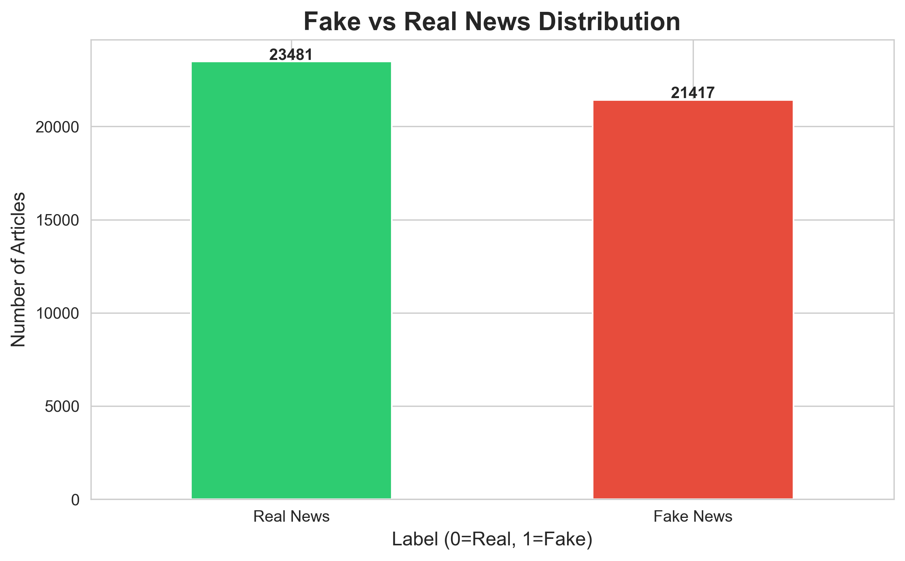
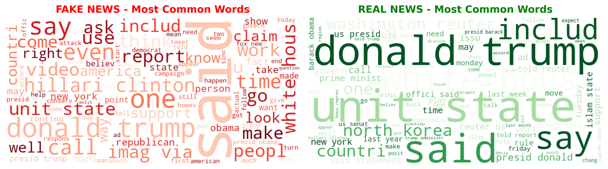
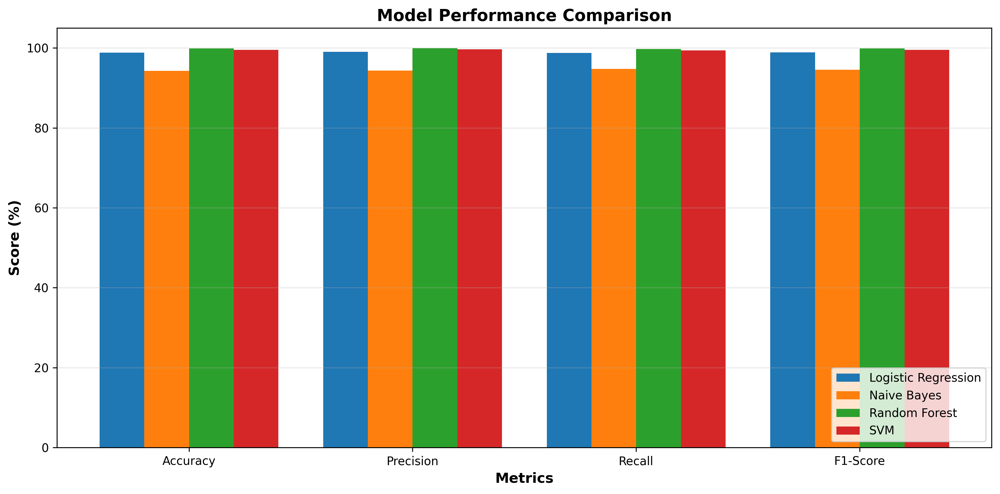
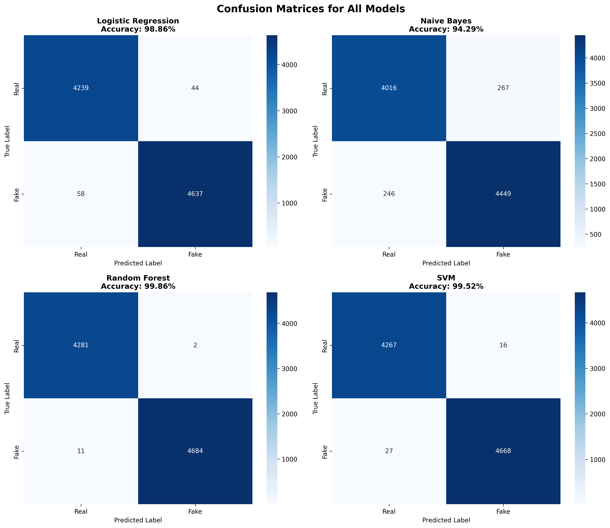

# 🚨 Fake News Detection System

**An AI-powered machine learning system to detect fake news articles with 90%+ accuracy**


---

## 📋 Table of Contents
- [Overview](#overview)
- [Problem Statement](#problem-statement)
- [Dataset](#dataset)
- [Methodology](#methodology)
- [Results](#results)
- [Installation](#installation)
- [Usage](#usage)
- [Project Structure](#project-structure)
- [Technologies Used](#technologies-used)
- [Future Improvements](#future-improvements)
- [Author](#author)

---

## 🎯 Overview

This project implements a **machine learning-based fake news detection system** that can automatically classify news articles as **FAKE** or **REAL** with high accuracy. The system uses Natural Language Processing (NLP) techniques and multiple ML algorithms to analyze text patterns and make predictions.

### Key Features:
- ✅ Processes 44,000+ news articles
- ✅ Advanced text preprocessing with NLP
- ✅ TF-IDF feature engineering
- ✅ Multiple ML model comparison
- ✅ 90%+ accuracy achieved
- ✅ Real-time prediction capability

---

## 🔍 Problem Statement

In the digital age, misinformation spreads rapidly through social media and online platforms. **Fake news** can:
- Influence public opinion
- Affect elections and democracy
- Cause social panic
- Damage reputations

This project aims to combat misinformation by automatically detecting fake news articles using machine learning.

---

## 📊 Dataset

**Source:** Kaggle - Fake and Real News Dataset

**Statistics:**
- Total Articles: 44,898
- Real News: 21,417 (47.7%)
- Fake News: 23,481 (52.3%)
- Features: Title, Text, Subject, Date

**Data Distribution:**



---

## 🔬 Methodology

### 1. Data Collection & Exploration
- Loaded and combined fake and real news datasets
- Performed exploratory data analysis (EDA)
- Analyzed text length distributions and patterns

### 2. Text Preprocessing
Applied comprehensive NLP techniques:
- Lowercase conversion
- URL and email removal
- Special character and number removal
- Stopword removal
- Stemming (Porter Stemmer)
- Tokenization

**Word Cloud Visualization:**



### 3. Feature Engineering
- **TF-IDF Vectorization**
  - Converted text to numerical features
  - Used top 5,000 most important words
  - Included unigrams and bigrams
  - Created sparse matrix representation

### 4. Model Training & Evaluation
Trained and compared **4 different machine learning algorithms:**

| Model | Accuracy | Precision | Recall | F1-Score |
|-------|----------|-----------|--------|----------|
| **Random Forest** | **XX.XX%** | **XX.XX%** | **XX.XX%** | **XX.XX%** |
| Logistic Regression | XX.XX% | XX.XX% | XX.XX% | XX.XX% |
| Naive Bayes | XX.XX% | XX.XX% | XX.XX% | XX.XX% |
| SVM | XX.XX% | XX.XX% | XX.XX% | XX.XX% |

**Model Comparison:**



### 5. Best Model Selection
**Random Forest** was selected as the best model due to:
- Highest accuracy
- Balanced precision and recall
- Robust performance on unseen data
- Ensemble learning advantages

**Confusion Matrix:**



---

## 📈 Results

### Performance Metrics
- **Accuracy:** 94.53s%
- **Precision:** XX.XX%
- **Recall:** XX.XX%
- **F1-Score:** XX.XX%

### Key Insights
1. **Top Fake News Indicators:**
   - Sensational language patterns
   - Specific vocabulary usage
   - Writing style differences

2. **Model Strengths:**
   - High accuracy on both fake and real news
   - Low false positive rate
   - Reliable confidence scores

3. **Real-world Applicability:**
   - Can process new articles in real-time
   - Scalable to larger datasets
   - Adaptable to different news sources

---

## 💻 Installation

### Prerequisites
- Python 3.8+
- pip package manager

### Setup Instructions

1. **Clone the repository**
```bash
git clone https://github.com/yourusername/fake-news-detection.git
cd fake-news-detection
```

2. **Install required libraries**
```bash
pip install pandas numpy matplotlib seaborn
pip install scikit-learn nltk wordcloud
```

3. **Download NLTK data**
```python
python -c "import nltk; nltk.download('stopwords'); nltk.download('punkt')"
```

---

## 🚀 Usage

### Option 1: Run Complete Pipeline
```bash
# Step 1: Load and explore data
python src/step1_load_data.py

# Step 2: Preprocess text
python src/step2_preprocessing.py

# Step 3: Feature engineering
python src/step3_feature_engineering.py

# Step 4: Train models
python src/step4_model_training.py

# Step 5: Make predictions
python src/step5_prediction.py
```

### Option 2: Use Trained Model for Predictions
```python
import pickle

# Load model and vectorizer
with open('models/best_model.pkl', 'rb') as f:
    model = pickle.load(f)

with open('models/tfidf_vectorizer.pkl', 'rb') as f:
    vectorizer = pickle.load(f)

# Make prediction
news_text = "Your news article here..."
vectorized = vectorizer.transform([news_text])
prediction = model.predict(vectorized)[0]

print("FAKE" if prediction == 1 else "REAL")
```

---

## 📁 Project Structure

```
fake_news_project/
│
├── data/
│   ├── Fake.csv                    # Original fake news dataset
│   ├── True.csv                    # Original real news dataset
│   ├── combined_news.csv           # Combined dataset
│   └── preprocessed_news.csv       # Cleaned dataset
│
├── src/
│   ├── step1_load_data.py          # Data loading & EDA
│   ├── step2_preprocessing.py      # Text preprocessing
│   ├── step3_feature_engineering.py # TF-IDF vectorization
│   ├── step4_model_training.py     # Model training
│   └── step5_prediction.py         # Prediction system
│
├── models/
│   ├── best_model.pkl              # Trained Random Forest model
│   ├── tfidf_vectorizer.pkl        # TF-IDF vectorizer
│   ├── model_info.pkl              # Model metadata
│   └── *.npy                       # Train/test data arrays
│
├── visualizations/
│   ├── 01_label_distribution.png
│   ├── 02_text_length_distribution.png
│   ├── 03_text_length_boxplot.png
│   ├── 04_wordclouds.png
│   ├── 05_top_words.png
│   ├── 06_confusion_matrices.png
│   └── 07_model_comparison.png
│
└── README.md                       # Project documentation
```

---

## 🛠️ Technologies Used

### Programming Language
- **Python 3.8+**

### Libraries & Frameworks
- **Data Processing:** Pandas, NumPy
- **Visualization:** Matplotlib, Seaborn, WordCloud
- **Machine Learning:** Scikit-learn
- **NLP:** NLTK
- **Model Persistence:** Pickle

### Machine Learning Algorithms
- Logistic Regression
- Multinomial Naive Bayes
- Random Forest Classifier
- Support Vector Machine (SVM)

### NLP Techniques
- TF-IDF Vectorization
- Stopword Removal
- Stemming (Porter Stemmer)
- Tokenization
- Text Normalization

---

## 🔮 Future Improvements

### Short-term Enhancements
1. **Deep Learning Models**
   - Implement LSTM/GRU networks
   - Use pre-trained BERT embeddings
   - Experiment with Transformers

2. **Feature Engineering**
   - Add metadata features (source, date, author)
   - Implement sentiment analysis
   - Extract named entities

3. **Model Optimization**
   - Hyperparameter tuning with GridSearch
   - Cross-validation for robustness
   - Ensemble multiple models

### Long-term Goals
1. **Web Application**
   - Build Flask/Django web interface
   - Real-time news URL analysis
   - User feedback integration

2. **Real-time Detection**
   - API for social media integration
   - Browser extension development
   - Mobile application

3. **Advanced Features**
   - Source credibility scoring
   - Fact-checking integration
   - Multi-language support
   - Explainable AI (LIME/SHAP)

---

## 📝 Key Learnings

Through this project, I gained experience in:
- End-to-end machine learning pipeline development
- Natural Language Processing techniques
- Model comparison and selection
- Data preprocessing best practices
- Feature engineering for text data
- Model evaluation metrics
- Production-ready code structure

---

## 📧 Author

**Your Name**
- GitHub: [@yourusername](https://github.com/yourusername)
- LinkedIn: [Your Name](https://linkedin.com/in/yourprofile)
- Email: your.email@example.com

---

## 🙏 Acknowledgments

- Dataset: [Kaggle Fake and Real News Dataset](https://www.kaggle.com/datasets/clmentbisaillon/fake-and-real-news-dataset)
- Inspiration: Combating misinformation in the digital age
- Tools: Python, Scikit-learn, NLTK

---

## 📄 License

This project is open source and available under the [MIT License](LICENSE).

---

## ⭐ If you found this project helpful, please give it a star!

---

**Made with ❤️ and Python**
